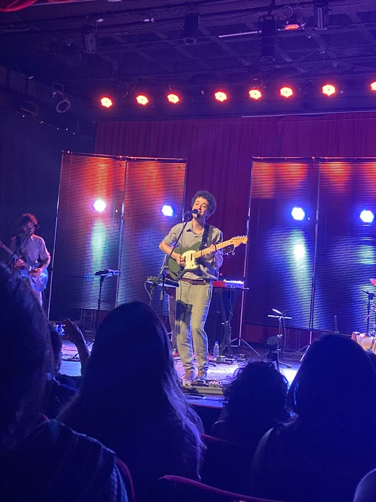
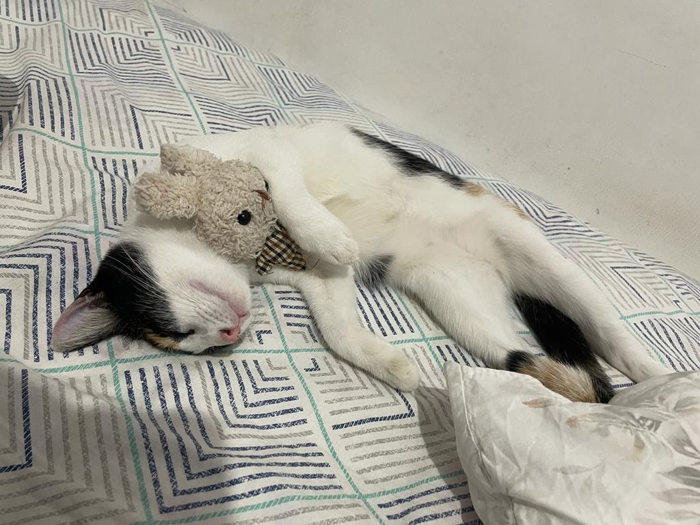
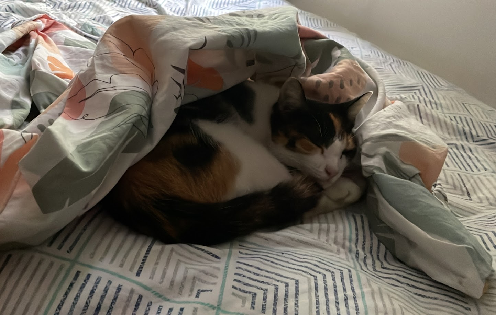
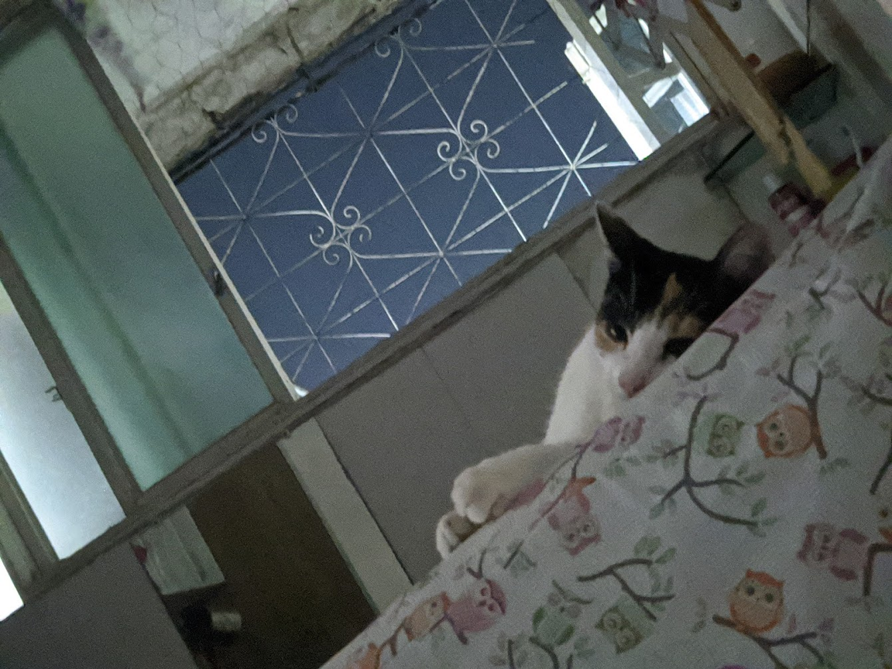
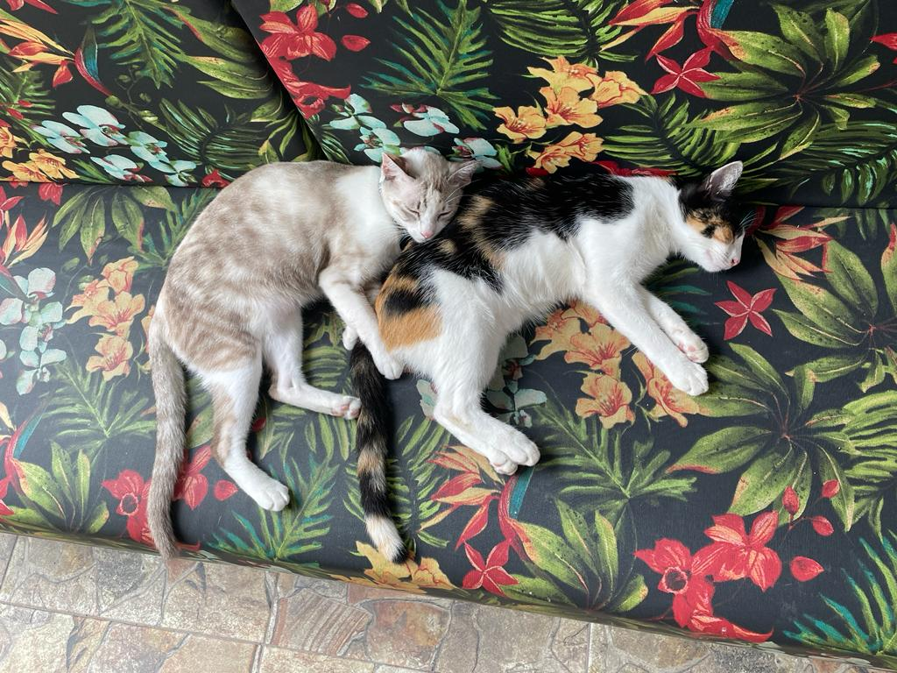
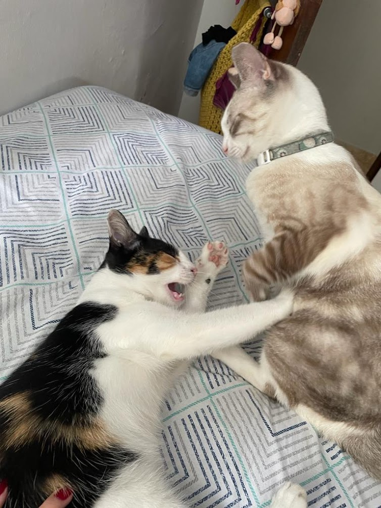
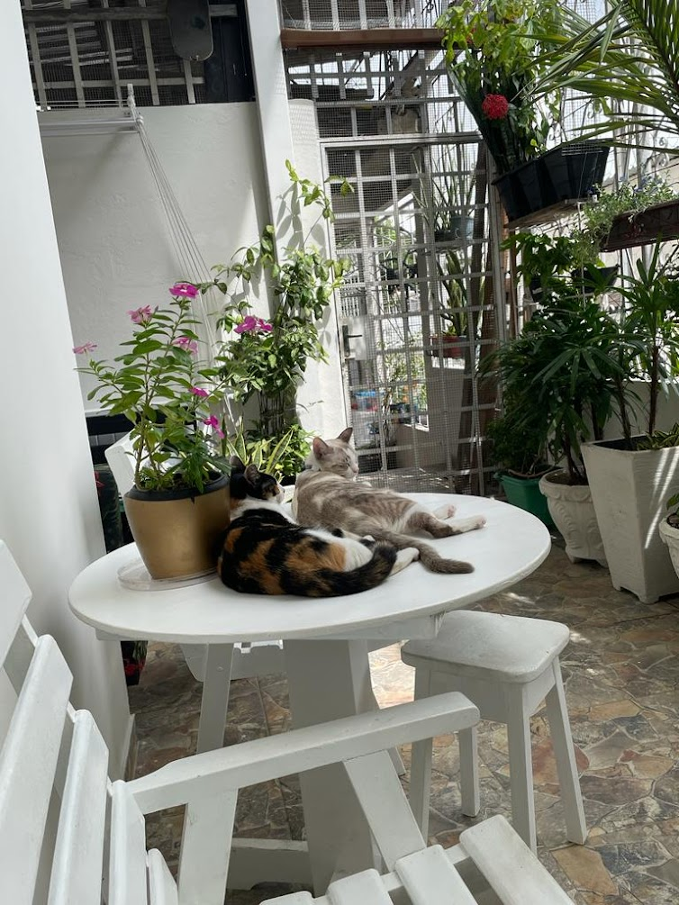
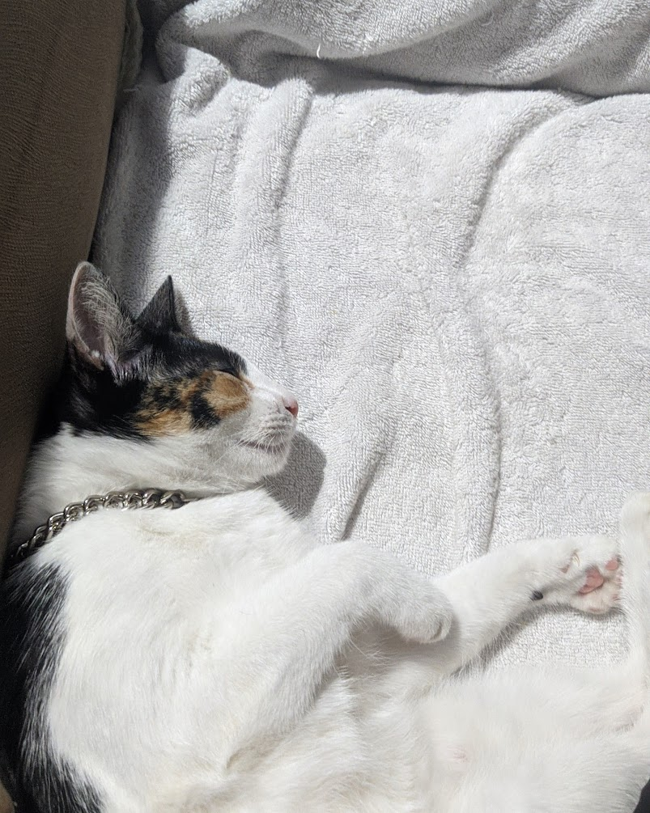

import video1 from './1.mp4';
import video6 from './6.mp4';

# sobre a lava

> como eu conheci a lava?  
> eu aleatóriamente encontrei uma amiga no show no cíceco,  
> uma das primeiras coisas que ela fez foi me mostrar a foto de um gato tricolor.  
> nesse momento eu tinha muita certeza da decisão que eu iria tomar.

cicero @ manaus (2022)

> sem pensar muito eu adotei ela,  
> o primeiro dia dela na nova casa:

<video src={video1} autoplay loop muted />
 

> ela sempre amou dormir em cima da maquina de lavar

> ou das plantas...
> ela vivia com o cheiro de terra molhada

> em geral acho que a vida de gatos se resumem em brincar, comer e dormir...

<video src={video6} autoplay loop muted />

> mas ela também tinha irmãos!  
> como a _ivy_:

> e o _uli_:

- adicionar fotos do uli

> e essa é a história resumida da minha gata, mas nem tudo são flores.  
> infelizmente ela morreu em 25 de fev. de 2024.  
> então esse espaço digital é um pequeno tributo à tudo que ela me proporcionou  
> espero que você governe o céu dos gatos como uma imperatriz.  
> obrigada por ter sido minha gata, eu te amo!

